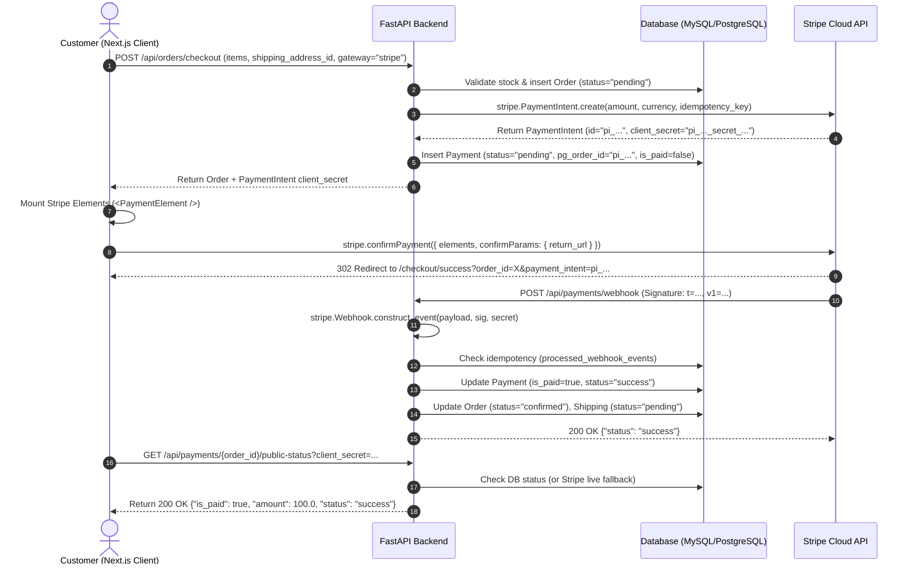

# Comprehensive Stripe Payment Gateway Integration Guide for FastAPI

> **Document Type:** Production Architecture, Step-by-Step Implementation & Technical Reference  
> **Backend Framework:** FastAPI (Python 3.12+, Async SQLAlchemy, Pydantic V2)  
> **Frontend Integration:** Next.js (React 19 / Next.js 16, @stripe/stripe-js, @stripe/react-stripe-js)  
> **Payment Engine:** Official Stripe Python SDK (`stripe >= 11.0.0`)  
> **Database:** MySQL / PostgreSQL via Async SQLAlchemy ORM  

---

## Table of Contents

1. [Architectural Overview & Project Structure](#1-architectural-overview--project-structure)
2. [End-to-End Payment Lifecycle (Sequence Diagram)](#2-end-to-end-payment-lifecycle-sequence-diagram)
3. [Step 0: Prerequisites & Environment Configuration](#step-0-prerequisites--environment-configuration)
4. [Step 1: Database Schema & Status Enums](#step-1-database-schema--status-enums)
5. [Step 2: Pluggable Gateway Contract (Strategy Pattern)](#step-2-pluggable-gateway-contract-strategy-pattern)
6. [Step 3: Official Stripe Gateway Implementation](#step-3-official-stripe-gateway-implementation)
7. [Step 4: Request & Response Schemas (Pydantic V2)](#step-4-request--response-schemas-pydantic-v2)
8. [Step 5: Business Services & State Machine](#step-5-business-services--state-machine)
9. [Step 6: Cryptographic Webhooks & Replay Protection](#step-6-cryptographic-webhooks--replay-protection)
10. [Step 7: Order Cancellation & Automated Stripe Refunds](#step-7-order-cancellation--automated-stripe-refunds)
11. [Step 8: Next.js Frontend Integration with Stripe Elements](#step-8-nextjs-frontend-integration-with-stripe-elements)
12. [Step 9: Testing, Verification & Production Checklist](#step-9-testing-verification--production-checklist)

---

## 1. Architectural Overview & Project Structure

The payment architecture utilizes the **Strategy Design Pattern** combined with **Inversion of Control**. Payment gateway providers (Stripe, Mock, or future alternatives like PayPal) adhere to a unified abstract interface (`BasePaymentGateway`). 

### File Layout in `ecommfastapi`

```text
ecommfastapi/
├── .env                                  # Secret keys & provider endpoints
├── requirements.txt                      # Dependencies (stripe, sqlalchemy, etc.)
├── app/
│   ├── main.py                           # App entrypoint, CORS & router mounting
│   ├── db/
│   │   ├── base.py                       # SQLAlchemy Base
│   │   └── config.py                     # Async database engine & session dependency
│   ├── account/                          # Authentication & User models
│   ├── order/                            # Order management & inventory stock
│   │   ├── models.py                     # Order & OrderItem ORM models
│   │   ├── services.py                   # Checkout, order querying, cancel_order()
│   │   ├── stock.py                      # Stock restoration on cancel / fail
│   │   └── routers.py                    # Order API endpoints
│   ├── shipping/                         # Shipping address & delivery tracking
│   └── payment/                          # Core Payment Gateway Module
│       ├── __init__.py                   # Package exports
│       ├── config.py                     # StripeSettings & environment validator
│       ├── models.py                     # Payment & ProcessedWebhookEvent ORM models
│       ├── schemas.py                    # Pydantic request & response models
│       ├── idempotency.py                # Idempotency key builders
│       ├── utils.py                      # Currency unit conversion (cents/dollars)
│       ├── services.py                   # State machine, intent lifecycle & reconciliation
│       ├── routers.py                    # Public, authenticated & webhook routes
│       └── gateways/                     # Pluggable Provider Implementations
│           ├── __init__.py               # Gateway factory (get_payment_gateway)
│           ├── base.py                   # BasePaymentGateway abstract contract
│           ├── stripe.py                 # StripePaymentGateway (Official SDK)
│           └── mock.py                   # MockPaymentGateway (Automated testing)
└── tests/
    └── test_payment.py                   # Automated test suite (21 unit & integration tests)
```

---

## 2. End-to-End Payment Lifecycle (Sequence Diagram)



---

## 3. Step 0: Prerequisites & Environment Configuration

### Dependencies (`requirements.txt`)

```text
fastapi>=0.115.0
uvicorn[standard]>=0.32.0
stripe>=11.1.0
sqlalchemy>=2.0.35
aiomysql>=0.2.0
pydantic>=2.9.2
python-decouple>=3.8
```

### Environment Settings (`ecommfastapi/.env`)

```ini
# Database Connection
DB_USER=root
DB_PASS=your_password
DB_HOST=127.0.0.1
DB_PORT=3306
DB_NAME=ecomm_db

# Frontend URL (for CORS validation)
FRONTEND_URL=http://localhost:3000

# Stripe Official Sandbox Credentials
STRIPE_PUBLISHABLE_KEY=pk_test_51...
STRIPE_SECRET_KEY=sk_test_51...
STRIPE_WEBHOOK_SECRET=whsec_...
STRIPE_CURRENCY=usd

# Leave empty in production to connect directly to https://api.stripe.com
STRIPE_API_BASE=
```

### Stripe Configuration Loader (`app/payment/config.py`)

```python
"""
app/payment/config.py
Secure, decoupled configuration management for Stripe credentials.
"""
from dataclasses import dataclass
from decouple import config

@dataclass(frozen=True)
class StripeSettings:
    STRIPE_PUBLISHABLE_KEY: str
    STRIPE_SECRET_KEY: str
    STRIPE_WEBHOOK_SECRET: str
    STRIPE_CURRENCY: str
    STRIPE_API_BASE: str | None

def configure_stripe() -> StripeSettings:
    """
    Loads and validates Stripe environment configuration.
    Raises ValueError if mandatory production API keys are missing.
    """
    secret_key = config("STRIPE_SECRET_KEY", default="").strip()
    publishable_key = config("STRIPE_PUBLISHABLE_KEY", default="").strip()
    webhook_secret = config("STRIPE_WEBHOOK_SECRET", default="").strip()
    currency = config("STRIPE_CURRENCY", default="usd").strip().lower()
    api_base = config("STRIPE_API_BASE", default="").strip() or None

    if not secret_key:
        raise ValueError("CRITICAL: STRIPE_SECRET_KEY is not defined in .env")
    if not publishable_key:
        raise ValueError("CRITICAL: STRIPE_PUBLISHABLE_KEY is not defined in .env")

    return StripeSettings(
        STRIPE_PUBLISHABLE_KEY=publishable_key,
        STRIPE_SECRET_KEY=secret_key,
        STRIPE_WEBHOOK_SECRET=webhook_secret,
        STRIPE_CURRENCY=currency,
        STRIPE_API_BASE=api_base,
    )
```

---

## 4. Step 1: Database Schema & Status Enums

### Payment Status State Machine (`app/payment/models.py`)

```python
"""
app/payment/models.py
SQLAlchemy ORM models tracking payment records and webhook deduplication.
"""
from datetime import datetime, timezone
from enum import Enum as PyEnum
from typing import TYPE_CHECKING
from sqlalchemy.orm import Mapped, mapped_column, relationship
from sqlalchemy import Boolean, ForeignKey, DateTime, Enum, String, Numeric
from app.db.base import Base

if TYPE_CHECKING:
    from app.order.models import Order
    from app.account.models import User

class PaymentStatusEnum(str, PyEnum):
    pending = "pending"
    success = "success"
    failed = "failed"
    cancelled = "cancelled"
    refunded = "refunded"

class PaymentGatewayEnum(str, PyEnum):
    mock = "mock"
    stripe = "stripe"

class Payment(Base):
    __tablename__ = "payments"

    id: Mapped[int] = mapped_column(primary_key=True, index=True, autoincrement=True)
    order_id: Mapped[int] = mapped_column(ForeignKey("orders.id", ondelete="CASCADE"), nullable=False, unique=True)
    user_id: Mapped[int] = mapped_column(ForeignKey("users.id", ondelete="CASCADE"), nullable=False)
    amount: Mapped[float] = mapped_column(Numeric(10, 2), nullable=False)
    currency: Mapped[str] = mapped_column(String(10), default="usd", nullable=False)
    
    status: Mapped[PaymentStatusEnum] = mapped_column(
        Enum(PaymentStatusEnum), 
        default=PaymentStatusEnum.pending, 
        nullable=False
    )
    payment_gateway: Mapped[PaymentGatewayEnum] = mapped_column(
        Enum(PaymentGatewayEnum), 
        default=PaymentGatewayEnum.stripe, 
        nullable=False
    )
    is_paid: Mapped[bool] = mapped_column(Boolean, default=False)

    # Provider identifiers & metadata
    pg_order_id: Mapped[str | None] = mapped_column(String(100), nullable=True, index=True)   # Stripe PaymentIntent ID (pi_...)
    pg_payment_id: Mapped[str | None] = mapped_column(String(100), nullable=True)             # Stripe Charge ID (ch_...)
    pg_signature: Mapped[str | None] = mapped_column(String(255), nullable=True)
    client_secret: Mapped[str | None] = mapped_column(String(255), nullable=True)            # Stripe Elements client_secret
    error_message: Mapped[str | None] = mapped_column(String(500), nullable=True)            # Failure or Refund Reference

    created_at: Mapped[datetime] = mapped_column(DateTime(timezone=True), default=lambda: datetime.now(timezone.utc))
    updated_at: Mapped[datetime] = mapped_column(DateTime(timezone=True), default=lambda: datetime.now(timezone.utc), onupdate=lambda: datetime.now(timezone.utc))

    order: Mapped["Order"] = relationship("Order", back_populates="payment")
    user: Mapped["User"] = relationship("User", back_populates="payments")

class ProcessedWebhookEvent(Base):
    """
    Prevents duplicate processing of Stripe webhooks (replay attacks / at-least-once delivery).
    """
    __tablename__ = "processed_webhook_events"

    event_id: Mapped[str] = mapped_column(String(100), primary_key=True)
    event_type: Mapped[str] = mapped_column(String(100), nullable=False)
    processed_at: Mapped[datetime] = mapped_column(DateTime(timezone=True), default=lambda: datetime.now(timezone.utc))
```

---

## 5. Step 2: Pluggable Gateway Contract (Strategy Pattern)

### Abstract Base Class (`app/payment/gateways/base.py`)

```python
"""
app/payment/gateways/base.py
Standardized interface for all payment gateways.
"""
from abc import ABC, abstractmethod
from dataclasses import dataclass, field
from decimal import Decimal
from typing import Any
from app.payment.models import PaymentStatusEnum

@dataclass
class GatewayPaymentResult:
    """Normalized DTO returned by payment gateway operations."""
    status: PaymentStatusEnum
    is_paid: bool
    pg_order_id: str | None = None
    pg_payment_id: str | None = None
    pg_signature: str | None = None
    client_secret: str | None = None
    raw_response: dict[str, Any] = field(default_factory=dict)

class BasePaymentGateway(ABC):
    """Abstract contract that every payment provider must satisfy."""

    @abstractmethod
    async def create_payment(
        self,
        amount: Decimal | float,
        order_id: int,
        user_id: int,
        currency: str = "usd",
        metadata: dict[str, Any] | None = None,
        simulate_success: bool = True
    ) -> GatewayPaymentResult:
        """Initiates a payment with the provider."""
        pass

    @abstractmethod
    async def refund_payment(
        self,
        payment_id: str,
        amount: Decimal | float | None = None,
        currency: str = "usd",
        reason: str = "requested_by_customer",
        metadata: dict[str, Any] | None = None
    ) -> dict[str, Any]:
        """Issues a refund for a completed payment."""
        pass
```

---

## 6. Step 3: Official Stripe Gateway Implementation

### Production Implementation (`app/payment/gateways/stripe.py`)

```python
"""
app/payment/gateways/stripe.py
Full Stripe implementation utilizing the official stripe-python SDK.
"""
import uuid
import logging
from decimal import Decimal
from typing import Any
import stripe
from fastapi import HTTPException, status

from app.payment.config import StripeSettings, configure_stripe
from app.payment.gateways.base import BasePaymentGateway, GatewayPaymentResult
from app.payment.idempotency import build_idempotency_key
from app.payment.models import PaymentStatusEnum
from app.payment.utils import to_stripe_amount

logger = logging.getLogger(__name__)

class StripePaymentGateway(BasePaymentGateway):
    def __init__(self, settings: StripeSettings | None = None):
        self.settings = settings or configure_stripe()
        self._ensure_configured()

    def _ensure_configured(self):
        stripe.api_key = self.settings.STRIPE_SECRET_KEY
        if self.settings.STRIPE_API_BASE and self.settings.STRIPE_API_BASE.strip():
            stripe.api_base = self.settings.STRIPE_API_BASE.strip()
        else:
            stripe.api_base = "https://api.stripe.com"

    async def create_payment(
        self,
        amount: Decimal | float,
        order_id: int,
        user_id: int,
        currency: str | None = None,
        metadata: dict[str, Any] | None = None,
        simulate_success: bool = True
    ) -> GatewayPaymentResult:
        """
        Creates a Stripe PaymentIntent in smallest currency units (cents).
        Attaches idempotent keys to prevent accidental double billing.
        """
        charge_currency = (currency or self.settings.STRIPE_CURRENCY).lower().strip()
        stripe_amount = to_stripe_amount(amount, charge_currency)

        payment_metadata = {
            "order_id": str(order_id),
            "user_id": str(user_id),
            "source": "fastapi_backend"
        }
        if metadata:
            payment_metadata.update({str(k): str(v) for k, v in metadata.items()})

        # Deterministic idempotency key per payment creation attempt
        idempotency_key = build_idempotency_key(
            order_id=order_id,
            user_id=user_id,
            action="pi_create",
            attempt_id=uuid.uuid4().hex[:10]
        )

        try:
            intent = stripe.PaymentIntent.create(
                amount=stripe_amount,
                currency=charge_currency,
                metadata=payment_metadata,
                idempotency_key=idempotency_key,
                automatic_payment_methods={"enabled": True}
            )

            is_paid = (intent.status == "succeeded")
            status_enum = PaymentStatusEnum.success if is_paid else PaymentStatusEnum.pending

            return GatewayPaymentResult(
                status=status_enum,
                is_paid=is_paid,
                pg_order_id=intent.id,
                pg_payment_id=getattr(intent, "latest_charge", None),
                client_secret=intent.client_secret,
                raw_response={
                    "gateway": "stripe",
                    "id": intent.id,
                    "status": intent.status,
                    "amount": intent.amount,
                    "currency": intent.currency,
                    "client_secret": intent.client_secret,
                }
            )
        except stripe.CardError as exc:
            raise HTTPException(status_code=status.HTTP_400_BAD_REQUEST, detail=exc.user_message)
        except stripe.StripeError as exc:
            logger.error(f"Stripe error for order {order_id}: {exc}")
            raise HTTPException(status_code=status.HTTP_502_BAD_GATEWAY, detail="Stripe gateway processing error.")

    async def retrieve_payment_intent(self, payment_intent_id: str) -> dict[str, Any]:
        """Queries live status of a PaymentIntent from Stripe servers."""
        self._ensure_configured()
        intent = stripe.PaymentIntent.retrieve(payment_intent_id)
        return {
            "id": intent.id,
            "status": intent.status,
            "amount": intent.amount,
            "currency": intent.currency,
            "client_secret": intent.client_secret,
            "latest_charge": getattr(intent, "latest_charge", None),
        }

    async def refund_payment(
        self,
        payment_id: str,
        amount: Decimal | float | None = None,
        currency: str = "usd",
        reason: str = "requested_by_customer",
        metadata: dict[str, Any] | None = None
    ) -> dict[str, Any]:
        """Issues an official Stripe refund."""
        self._ensure_configured()
        refund_kwargs: dict[str, Any] = {
            "reason": reason,
            "metadata": metadata or {},
        }
        if payment_id.startswith("pi_"):
            refund_kwargs["payment_intent"] = payment_id
        elif payment_id.startswith("ch_"):
            refund_kwargs["charge"] = payment_id
        else:
            refund_kwargs["payment_intent"] = payment_id

        if amount is not None:
            refund_kwargs["amount"] = to_stripe_amount(amount, currency)

        refund = stripe.Refund.create(**refund_kwargs)
        return {
            "status": getattr(refund, "status", "succeeded"),
            "refund_id": getattr(refund, "id", f"re_{payment_id}"),
            "amount": (refund.amount / 100.0) if hasattr(refund, "amount") else float(amount or 0),
            "currency": getattr(refund, "currency", currency),
            "gateway": "stripe"
        }

    async def cancel_payment_intent(self, payment_intent_id: str) -> dict[str, Any]:
        """Cancels an uncaptured or pending PaymentIntent."""
        self._ensure_configured()
        try:
            intent = stripe.PaymentIntent.cancel(payment_intent_id)
            return {"id": intent.id, "status": intent.status}
        except stripe.InvalidRequestError:
            return {"id": payment_intent_id, "status": "already_closed"}
```

---

## 7. Step 4: Request & Response Schemas (Pydantic V2)

### Schema Definitions (`app/payment/schemas.py`)

```python
"""
app/payment/schemas.py
Pydantic V2 models for input validation and serialized responses.
"""
from datetime import datetime
from pydantic import BaseModel, Field
from app.payment.models import PaymentStatusEnum, PaymentGatewayEnum

class PaymentCreate(BaseModel):
    payment_gateway: PaymentGatewayEnum = PaymentGatewayEnum.stripe
    currency: str = Field(default="usd", max_length=10)

class PaymentIntentResponse(BaseModel):
    order_id: int
    payment_id: int
    payment_intent_id: str
    client_secret: str
    amount: float
    currency: str
    status: str
    publishable_key: str

class PaymentStatusResponse(BaseModel):
    order_id: int
    payment_id: int
    amount: float
    status: str
    is_paid: bool
    payment_gateway: str
    pg_order_id: str | None = None
    gateway_status: str | None = None
    order_status: str
```

---

## 8. Step 5: Business Services & State Machine

### Intent Management & Status Logic (`app/payment/services.py`)

```python
"""
app/payment/services.py
High-level payment state management and active reconciliation.
"""
import logging
from sqlalchemy import select
from sqlalchemy.ext.asyncio import AsyncSession
from fastapi import HTTPException, status

from app.order.models import Order, OrderStatusEnum
from app.payment.gateways import get_payment_gateway
from app.payment.gateways.stripe import StripePaymentGateway
from app.payment.models import Payment, PaymentStatusEnum, PaymentGatewayEnum
from app.payment.schemas import PaymentIntentResponse, PaymentStatusResponse

logger = logging.getLogger(__name__)

async def create_or_get_payment_intent(
    session: AsyncSession,
    order_id: int,
    user_id: int,
    currency: str = "usd"
) -> PaymentIntentResponse:
    order = await session.get(Order, order_id)
    if not order or order.user_id != user_id:
        raise HTTPException(status_code=404, detail="Order not found")

    payment_stmt = select(Payment).where(Payment.order_id == order_id)
    payment = (await session.scalars(payment_stmt)).first()

    stripe_gateway = get_payment_gateway(PaymentGatewayEnum.stripe)

    # 1. Reuse existing client_secret if still pending
    if payment and payment.payment_gateway == PaymentGatewayEnum.stripe and payment.pg_order_id:
        if isinstance(stripe_gateway, StripePaymentGateway):
            try:
                intent_info = await stripe_gateway.retrieve_payment_intent(payment.pg_order_id)
                # TERMINAL STATE GUARD: Prevent client from mounting an already-settled intent
                if intent_info.get("status") == "succeeded":
                    payment.is_paid = True
                    payment.status = PaymentStatusEnum.success
                    order.status = OrderStatusEnum.confirmed
                    await session.commit()
                    raise HTTPException(status_code=400, detail="This order has already been paid and confirmed.")
                
                if payment.client_secret:
                    return PaymentIntentResponse(
                        order_id=order.id,
                        payment_id=payment.id,
                        payment_intent_id=payment.pg_order_id,
                        client_secret=payment.client_secret,
                        amount=float(order.total_price),
                        currency=currency.lower(),
                        status=payment.status.value,
                        publishable_key=stripe_gateway.settings.STRIPE_PUBLISHABLE_KEY,
                    )
            except HTTPException:
                raise
            except Exception as e:
                logger.warning(f"Failed to retrieve remote intent: {e}")

    # 2. Otherwise create a new PaymentIntent with Stripe
    result = await stripe_gateway.create_payment(
        amount=order.total_price,
        order_id=order.id,
        user_id=user_id,
        currency=currency.lower()
    )

    if not payment:
        payment = Payment(
            order_id=order.id,
            user_id=user_id,
            amount=order.total_price,
            currency=currency.lower(),
            payment_gateway=PaymentGatewayEnum.stripe,
            status=result.status,
            is_paid=result.is_paid,
            pg_order_id=result.pg_order_id,
            client_secret=result.client_secret,
        )
        session.add(payment)
    else:
        payment.pg_order_id = result.pg_order_id
        payment.client_secret = result.client_secret
        payment.is_paid = result.is_paid

    await session.commit()
    await session.refresh(payment)

    return PaymentIntentResponse(
        order_id=order.id,
        payment_id=payment.id,
        payment_intent_id=result.pg_order_id or "",
        client_secret=result.client_secret or "",
        amount=float(order.total_price),
        currency=currency.lower(),
        status=payment.status.value,
        publishable_key=stripe_gateway.settings.STRIPE_PUBLISHABLE_KEY,
    )
```

---

## 9. Step 6: Cryptographic Webhooks & Replay Protection

### Webhook Router (`app/payment/routers.py`)

```python
"""
app/payment/routers.py
API endpoints for public lookups, authenticated status, and cryptographic webhooks.
"""
import logging
import stripe
from fastapi import APIRouter, Depends, Header, HTTPException, Request, status
from app.db.config import SessionDep
from app.payment.config import configure_stripe
from app.payment.services import process_stripe_webhook_event, get_payment_status
from app.payment.schemas import PaymentStatusResponse

router = APIRouter()
logger = logging.getLogger(__name__)

@router.get("/{order_id}/public-status", response_model=PaymentStatusResponse)
async def check_public_payment_status(
    session: SessionDep,
    order_id: int,
    client_secret: str
):
    """
    Public lookup authorized strictly by matching the Stripe PaymentIntent client_secret or ID.
    Immune to session cookie expiry on external redirect.
    """
    return await get_payment_status(
        session=session,
        order_id=order_id,
        user_id=None,
        client_secret=client_secret
    )

@router.post("/webhook")
async def stripe_webhook(
    request: Request,
    session: SessionDep,
    stripe_signature: str | None = Header(None, alias="Stripe-Signature"),
):
    """
    Cryptographically verifies Stripe HMAC-SHA256 signature using the raw request body.
    """
    settings = configure_stripe()
    if not stripe_signature:
        raise HTTPException(status_code=400, detail="Missing Stripe-Signature header")

    payload = await request.body()
    try:
        event = stripe.Webhook.construct_event(
            payload=payload,
            sig_header=stripe_signature,
            secret=settings.STRIPE_WEBHOOK_SECRET
        )
    except stripe.SignatureVerificationError as e:
        logger.warning(f"Invalid webhook signature: {e}")
        raise HTTPException(status_code=400, detail="Invalid signature")

    if hasattr(event, "to_dict"):
        event = event.to_dict()

    return await process_stripe_webhook_event(session, event)
```

---

## 10. Step 7: Order Cancellation & Automated Stripe Refunds

### Service Function (`app/order/services.py`)

```python
"""
app/order/services.py (Cancellation & Refund Logic)
"""
from sqlalchemy import select
from sqlalchemy.ext.asyncio import AsyncSession
from fastapi import HTTPException, status

from app.order.models import Order, OrderStatusEnum
from app.order.stock import restore_order_stock
from app.payment.gateways import get_payment_gateway
from app.payment.models import Payment, PaymentStatusEnum, PaymentGatewayEnum
from app.shipping.models import ShippingStatusEnum

async def cancel_order(session: AsyncSession, user_id: int, order_id: int) -> Order:
    order = await session.get(Order, order_id)
    if not order or order.user_id != user_id:
        raise HTTPException(status_code=404, detail="Order not found")

    if order.status == OrderStatusEnum.cancelled:
        raise HTTPException(status_code=400, detail="Order is already cancelled")

    # Only cancel if order has not shipped yet
    if order.shipping_status and order.shipping_status.status != ShippingStatusEnum.pending:
        raise HTTPException(status_code=400, detail="Cannot cancel order once it has been processed or shipped")

    # 1. Update order and shipping status
    order.status = OrderStatusEnum.cancelled
    if order.shipping_status:
        order.shipping_status.status = ShippingStatusEnum.cancelled

    # 2. Restore reserved catalog inventory
    await restore_order_stock(session, order.id)

    # 3. Process Automatic Gateway Refund
    payment_stmt = select(Payment).where(Payment.order_id == order.id)
    payment = (await session.scalars(payment_stmt)).first()

    if payment:
        if payment.is_paid:
            # Payment was completed: issue a real Stripe refund
            gateway = get_payment_gateway(payment.payment_gateway)
            target_id = payment.pg_order_id or payment.pg_payment_id
            if target_id:
                refund_res = await gateway.refund_payment(
                    payment_id=target_id,
                    amount=payment.amount,
                    currency=payment.currency,
                    reason="requested_by_customer",
                    metadata={"order_id": str(order.id), "user_id": str(user_id)}
                )
                payment.status = PaymentStatusEnum.refunded
                payment.is_paid = False
                refund_id = refund_res.get("refund_id")
                payment.error_message = f"Refunded: {refund_id}" if refund_id else "Refunded successfully"
        else:
            # Payment was not settled: cancel pending intent
            if payment.payment_gateway == PaymentGatewayEnum.stripe and payment.pg_order_id:
                stripe_gw = get_payment_gateway(PaymentGatewayEnum.stripe)
                await stripe_gw.cancel_payment_intent(payment.pg_order_id)
            payment.status = PaymentStatusEnum.cancelled
            payment.is_paid = False

    await session.commit()
    await session.refresh(order)
    return order
```

---

## 11. Step 8: Next.js Frontend Integration with Stripe Elements

### 1. Stripe Singleton Loader (`utils/stripe.js`)

```javascript
// utils/stripe.js
import { loadStripe } from "@stripe/stripe-js";

let stripePromise;
export const getStripe = () => {
  if (!stripePromise) {
    stripePromise = loadStripe(process.env.NEXT_PUBLIC_STRIPE_PUBLISHABLE_KEY);
  }
  return stripePromise;
};

export const stripeElementsAppearance = {
  theme: "stripe",
  variables: {
    colorPrimary: "#4f46e5", // Indigo-600
    colorBackground: "#ffffff",
    colorText: "#0f172a",
    borderRadius: "12px",
    fontFamily: "Inter, system-ui, sans-serif",
  },
};
```

### 2. Embedded Stripe Form (`components/payment/StripePaymentForm.jsx`)

```jsx
// components/payment/StripePaymentForm.jsx
"use client";

import React, { useState } from "react";
import { Elements, PaymentElement, useStripe, useElements } from "@stripe/react-stripe-js";
import { getStripe, stripeElementsAppearance } from "@/utils/stripe";

function CheckoutForm({ orderId, amount, onCancel, customerEmail }) {
  const stripe = useStripe();
  const elements = useElements();
  const [isProcessing, setIsProcessing] = useState(false);
  const [errorMessage, setErrorMessage] = useState("");
  const [isComplete, setIsComplete] = useState(false);

  const handleSubmit = async (e) => {
    e.preventDefault();
    if (!stripe || !elements) return;

    setIsProcessing(true);
    setErrorMessage("");

    try {
      const returnUrl = `${window.location.origin}/checkout/success?order_id=${orderId}`;

      const { error } = await stripe.confirmPayment({
        elements,
        confirmParams: {
          return_url: returnUrl,
          receipt_email: customerEmail || undefined,
        },
      });

      if (error) {
        if (error.message?.toLowerCase().includes("incomplete")) {
          setErrorMessage(
            "Please click on your saved card above to select it, or click the '···' menu next to your email to use another card."
          );
        } else {
          setErrorMessage(error.message || "Payment validation failed.");
        }
      }
    } catch (err) {
      setErrorMessage("Network error occurred. Please try again.");
    } finally {
      setIsProcessing(false);
    }
  };

  return (
    <form onSubmit={handleSubmit} className="space-y-6">
      <div className="p-4 bg-white border border-slate-200 rounded-xl shadow-xs">
        <PaymentElement
          id="payment-element"
          options={{
            layout: { type: "tabs", defaultCollapsed: false },
            wallets: { applePay: "auto", googlePay: "auto" },
          }}
          onChange={(event) => {
            setIsComplete(event.complete);
            if (event.complete) setErrorMessage("");
          }}
        />
        <p className="text-[11px] text-slate-500 text-center mt-3 pt-2.5 border-t border-slate-100 flex items-center justify-center gap-1">
          <span>💡</span>
          <span>Click on your card above to confirm it, or click <strong>···</strong> to enter a different card.</span>
        </p>
      </div>

      {errorMessage && (
        <div className="p-4 rounded-xl bg-red-50 border border-red-200 text-red-700 text-xs">
          <strong>Action Required:</strong> {errorMessage}
        </div>
      )}

      <button
        type="submit"
        disabled={isProcessing || !stripe || !elements}
        className="w-full py-4 px-6 bg-indigo-600 hover:bg-indigo-700 text-white font-semibold text-sm rounded-xl transition"
      >
        {isProcessing ? "Verifying & Processing Payment..." : `Pay $${Number(amount).toFixed(2)} USD`}
      </button>
    </form>
  );
}

export default function StripePaymentForm({ clientSecret, orderId, amount, customerEmail, onCancel }) {
  if (!clientSecret) return <div>Loading payment session...</div>;

  return (
    <Elements stripe={getStripe()} options={{ clientSecret, appearance: stripeElementsAppearance }}>
      <CheckoutForm orderId={orderId} amount={amount} customerEmail={customerEmail} onCancel={onCancel} />
    </Elements>
  );
}
```

---

## 12. Step 9: Testing, Verification & Production Checklist

### Official Test Card Reference

| Card Brand | Card Number | Expiration | CVC | Expected Result |
| :--- | :--- | :--- | :--- | :--- |
| **Visa (Standard)** | `4242 4242 4242 4242` | Any future date | `123` | **Successful Payment (`succeeded`)** |
| **Visa (Declined)** | `4000 0000 0000 0002` | Any future date | `123` | **Card Declined (`card_declined`)** |
| **Visa (3DS Auth)** | `4000 0000 0000 3063` | Any future date | `123` | **Triggers 3D-Secure Modal** |

### Local Webhook Testing via Stripe CLI

```powershell
# 1. Forward all incoming webhooks to your local FastAPI server
stripe listen --forward-to localhost:8000/api/payments/webhook

# 2. Trigger simulated events to verify state machine transitions
stripe trigger payment_intent.succeeded
stripe trigger payment_intent.payment_failed
stripe trigger charge.refunded
```

### Production Launch Checklist

- [x] Rotate API keys: replace all `pk_test_...` and `sk_test_...` with live keys (`pk_live_...`, `sk_live_...`).
- [x] Configure production Webhook endpoint in the Stripe Dashboard with `https://yourdomain.com/api/payments/webhook`.
- [x] Ensure HTTPS is enforced on both frontend and backend (Stripe.js mandates HTTPS in live mode).
- [x] Enable idempotency table cleaning job for `processed_webhook_events` older than 90 days.
- [x] Confirm that inventory stock restoration is active on both order cancellations and refund webhooks.
